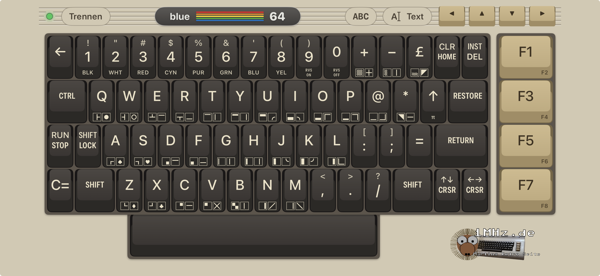
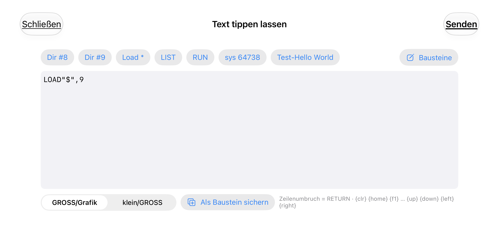

# Blue-64 Keyboard for iOS and Android

*Deutsche Fassung: [README.de.md](README.de.md)*

Turn your iPhone or Android phone into a wireless keyboard for a Commodore 64 fitted with a
[BT-64 / Blue-64](https://github.com/sideprojectslab/BT-64) Bluetooth adapter – no extra hardware needed.

▶ **Video on a real C64:** https://youtube.com/shorts/MC3hHcny5D0

The app shows a full C64-style keyboard (breadbin look, PETSCII graphics legends on the keycaps)
and sends every key press over Bluetooth Low Energy to the BT-64, which drives the C64 keyboard lines directly.

> **Requires the BT-64 firmware with the BLE keyboard service.**
> iOS apps are not allowed to act as a Bluetooth HID keyboard, so the firmware provides a small
> custom BLE service instead. See [docs/FIRMWARE.md](docs/FIRMWARE.md).

## Get the app

- **iPhone – TestFlight (beta):** link follows soon
- **iPhone – App Store:** planned
- **Android:** download `Blue64-Keyboard-Android-x.y.z.apk` from the
  [latest release](https://github.com/do2mad/blue64-keyboard-ios/releases/latest) on your phone and open it.
  Android asks once to allow installing apps from this source (browser / Files).

This repository contains the documentation, the BLE protocol and the releases.
The source code of the app is not published.

## Features

- Full C64 keyboard layout incl. RUN/STOP, RESTORE, C=, CTRL, SHIFT LOCK, CLR/HOME, INST/DEL and F1–F8
- Multi-touch; SHIFT / C= / CTRL can be held or tapped (one-shot, tap again to cancel)
- Keycap legends like the original: C= and SHIFT graphics on the front of each key, colour names on the digits
- While SHIFT, C= or CTRL is active, every key shows the character the C64 will print
  (PETSCII graphics, colour codes, control functions)
- Follows the character set switch (SHIFT + C=): UPPER/graphics ↔ lower/UPPER
- **Type text:** let the BT-64 type any text or a short BASIC listing (up to 1024 characters)
- **Snippets:** your own text buttons (e.g. `LOAD"$",8`), editable and reorderable in the app
- Cursor shortcut keys, automatic reconnect, keys are released when the app goes to the background
- English and German user interface

## Requirements

- iPhone with iOS 17 or later, or an Android phone with Android 8.0 or later
  (Android 11 and older: location must be switched on for the Bluetooth search – Android requirement, the app does not use your location)
- A C64 with BT-64 / Blue-64 running the firmware with the BLE keyboard service ([docs/FIRMWARE.md](docs/FIRMWARE.md))

## Usage

- The app scans for the BT-64 automatically and remembers it. The LED in the top bar shows the state:
  green = connected, yellow = searching/connecting, red = off/disconnected.
- **ABC / Abc** shows the character set the keys display. It follows SHIFT + C= automatically;
  tap it if it gets out of sync (e.g. after a C64 reset).
- **Text** opens the text window. New line = RETURN, special keys:
  `{clr} {home} {f1}…{f8} {up} {down} {left} {right} {stop} {run} {pi}`.
  *UPPER/graphics* types letters unshifted (default C64 mode), *lower/UPPER* keeps the case.
- **Snippets** are the buttons at the top of the text window: tap to type them, manage them via
  **Snippets** (add, edit, delete, reorder, restore defaults).

## Protocol

The BLE protocol is open and documented in [docs/PROTOCOL.md](docs/PROTOCOL.md) –
feel free to write your own client for other platforms.

## Privacy

The app collects no data. See [PRIVACY.md](PRIVACY.md).

## Credits & license

- BT-64 / Blue-64 hardware and firmware by [SideProjectsLab](https://github.com/sideprojectslab/BT-64) (Apache-2.0)
- App by Martin Oswald (do2mad) – [1mhz.de](https://1mhz.de)

The app is © 2026 Martin Oswald, all rights reserved.
The documentation in this repository, including the protocol description, is licensed under
[CC BY 4.0](https://creativecommons.org/licenses/by/4.0/).
Changes: [CHANGELOG.md](CHANGELOG.md).

Commodore and Commodore 64 are trademarks of their respective owners.
This project is not affiliated with or endorsed by them or by SideProjectsLab.
